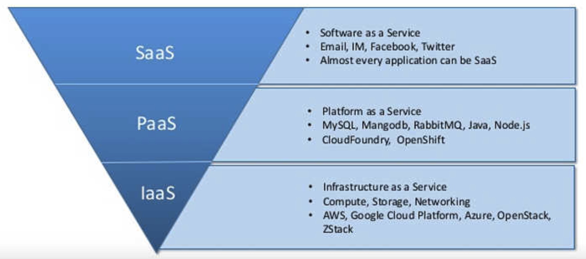

# IaaS/PaaS/SaaS

- IaaS (Infrastructure as a Service)：基础设施服务
  - 计算、存储、网络资源
  - AWS、阿里云、腾讯云
- PaaS (Platform as a Service)：平台服务
  - 操作系统、数据库、消息队列、执行环境、安全
  - CentOS、MySQL、RabbitMQ、Node
- SaaS (Software as a Service)：软件服务
  - 邮件、IM、社交软件等具体的业务应用
  - 几乎每个应用都可以是 SaaS

比如你想开一家披萨店 (你的产品)，但是从头到尾都自己准备太麻烦了，你打算外包一部分工作，采用他人的服务 (云服务)：

- IaaS
  - 他人提供厨房、炉子、煤气，并负责出问题时及时修复
- PaaS
  - 他人还提供披萨饼皮，你只需要设计配料然后烤出来
- SaaS
  - 他人提供一个做好的披萨，你只需要重新包装一下然后卖出去

