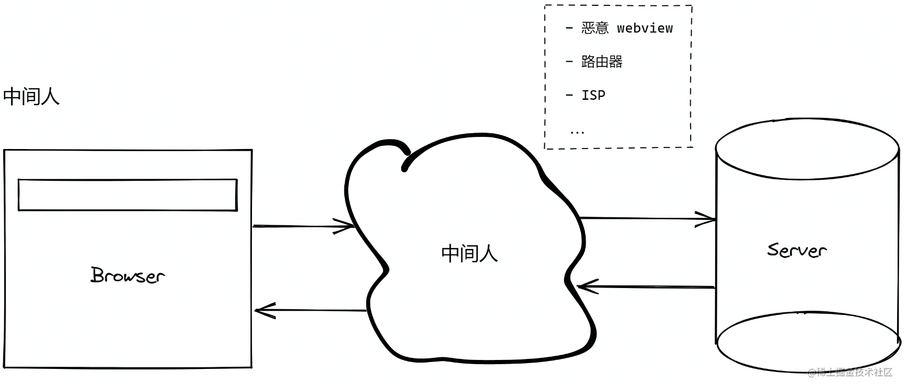

# 中间人攻击

中间人攻击 (Man-in-the-middle attack) 是指恶意 WebView、路由器、ISP 充当浏览器和服务端之间的中间人，转发或修改双方的通信内容，造成通信被窃听、篡改、冒充。

## 防御措施

- 使用 HTTPS 协议
  - 具有防窃听、防篡改、防冒充的特性
- 使用 HTTP/3 协议
- HSTS (HTTP Strict-Transport-Security)
- SRI (SubResource Integrity)
