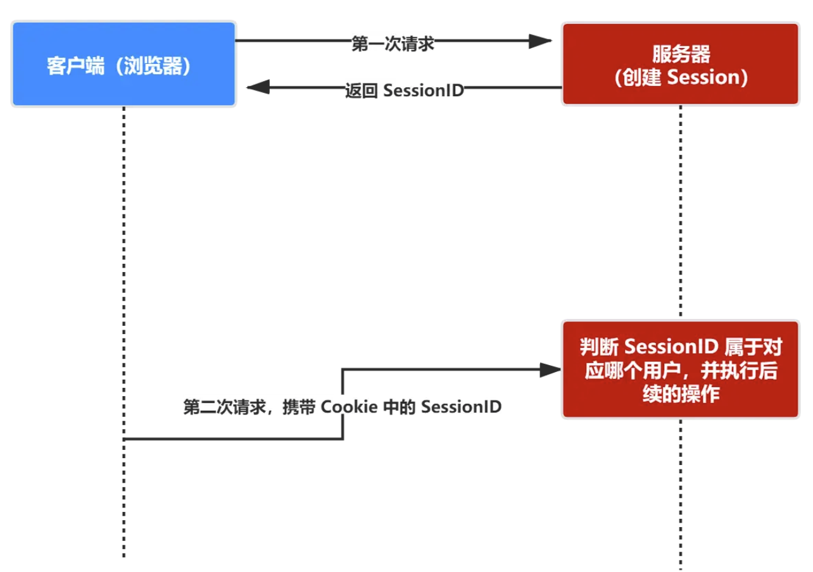

# Session

1. 客户端第一次请求服务端，服务端创建 session，返回对应的 session ID
2. 客户端把 session ID 保存到 cookie 中
3. 后续请求带上 cookie 中的 session ID，服务端就知道当前请求属于哪个用户

优点：

- cookie 自动发送，无需手动编写逻辑

缺点：

- 服务端需要保存 session，带来额外开销
- 多服务器之间的 session 同步增加了复杂度
- cookie 在跨域、非浏览器场景使用不太方便
- cookie 有 CSRF 风险
