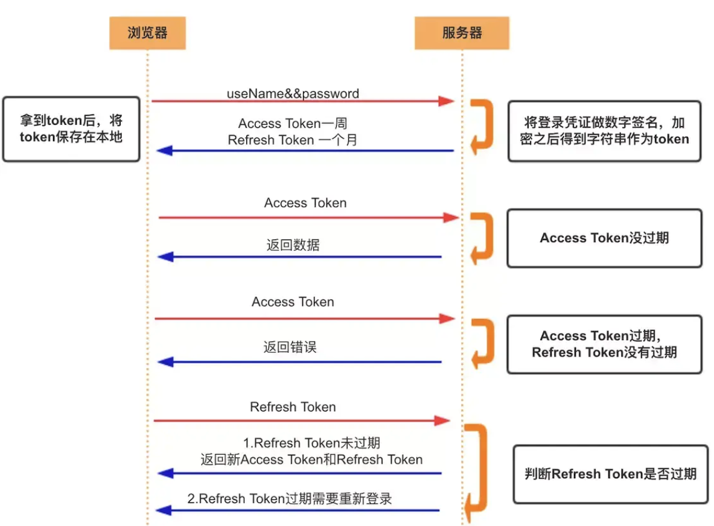

# Token

token 是一种**无状态**的认证和授权机制，相比 session 对服务端的负担更小。

## Access Token

Access Token 通常用于请求接口时的鉴权。

1. 用户登录请求，服务端生成加密后的 token
2. 客户端保存返回的 token，后续请求接口带上 token
3. 服务端解析 token，检查是否有效，有效则返回数据

## Refresh Token

Access Token 的有效期通常较短，Refresh Token 用于刷新 Access Token，通常有效期较长。

1. 用户登录请求，服务端生成有效期短的 access token 和有效期长的 refresh token
2. 客户端保存两种 token，后续请求接口带上 access token
3. 服务端检查 access token 是否有效
   - 有效则返回数据
   - 无效则返回错误
4. 客户端接收到 access token 过期的信息，带上 refresh token 请求鉴权接口
5. 服务端检查 refresh token 是否有效
   - 有效则返回新的 access token 和 refresh token
   - 无效则返回错误，提示用户需要重新登录

