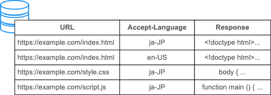

# 缓存

HTTP 缓存指的是保存某个请求的响应报文，后续有相同请求直接返回存储的响应。

缓存有很多优点：

- 减少响应时间，直接从缓存读取比请求服务器要快得多，优化用户体验
- 降低服务器负载，服务器无需处理被缓存的请求，提升网站性能
- 减少冗余的数据传输，节省带宽

## 缓存类型

缓存分为 2 大类：

- 私有缓存 (private cache)
  - 局限于单个客户端 (浏览器)
  - 使用响应头 `Cache-Control: private` 指定
  - 如果响应头包含 `Authorization`，该响应无法被缓存
- 共享缓存 (shared cache)
  - 存储在客户端和服务端之间的某个地方
  - 分为 proxy cache 和 managed cache

### proxy cache

客户端和服务端之间的代理服务器为了降低网络流量，会缓存一部分报文。服务端需要正确配置响应头，确保只缓存指定的报文。

为了兼容旧版本的代理服务器，有以下写法：

```text
Cache-Control: no-store, no-cache, max-age=0, must-revalidate, proxy-revalidate
```

由于 HTTPS 的流行，报文都被加密，代理服务器看不到报文内容，也无法对报文进行缓存，不必担心代理服务器会缓存不想被缓存的报文。

### managed cache

服务端部署的缓存，用于降低服务器负载，比如 CDN、反向代理等。

由于这些缓存由服务端管理，不必遵循 HTTP 缓存规则，能够实现更灵活的缓存管理，比如删除缓存、用响应头禁用缓存而只使用 managed cache 等。

综上，缓存有 private cache、proxy cache、managed cache。

## 启发式缓存

启发式缓存 (heuristic caching) 是在 `Cache-Control` 出现前的一种临时方法，指的是 HTTP 应该尽可能多地缓存报文。

如果响应头包含 `Last-Modified` 并且最后修改的日期距现在有较长时间，则可以缓存该报文，有效时间设为相距时间的 10%。比如报文有 1 年没有修改了，则缓存的有效期设为 0.1 年。

这种方法不够准确，目前已经被 `Cache-Control` 替代，**所有**响应报文都应该加上 `Cache-Control` 头部。

## 缓存状态

缓存有 2 种状态：fresh (没过期/新鲜) 和 stale (过期/不新鲜)。

`Cache-Control` 中往往会指定 `max-age`，以秒为单位的整数。客户端会缓存该报文，并记录 `max-age` 和响应生成的时间 `Date`。

当请求命中缓存时，计算当前时间与响应生成时间的差值，如果超过了 `max-age`，则缓存过期 (stale)，否则没过期 (fresh)，可以直接返回。

如果客户端和服务端之间存在 proxy cache，则代理服务器还需要在 `Age` 字段发回已经缓存的时间。比如 `max-age` 是 7 天，`Age` 是 1 天，则客户端缓存的时候需要设置 `max-age` 为 6 天。

## Expires

HTTP/1.0 时期经常用 `Expires` 指定缓存过期的时间，但是有以下缺点：

- 时间字符串比较难解析，有很多实现 bug
- 可以通过修改系统时钟影响缓存的有效性

HTTP/1.1 采用了 `Cache-Control` 中的 `max-age`，相比 `Expires` 实现更方便、安全，完全可以替代 `Expires`。如果 `Expires` 和 `max-age` 同时指定，会优先采取 `max-age`。

## Vary

缓存默认通过 URL 进行区分，相同的 URL 会返回相同的缓存，但很多情况不是这样。比如通过 `Accept`、`Accept-Language`、`Accept-Encoding` 进行内容协商，不同的请求头会返回不同的内容，应该分开缓存。

可以在 `Vary` 中指定缓存的 key，比如：

```text
Vary: Accept-Language
```

缓存查找时就会同时考虑 URL 和 `Accept-Language` 的值。



## revalidation

处于 stale 状态的报文并不会被立即丢弃，而是要通过一个**重新验证 (revalidation)** 的过程，确认这条缓存是否可以继续使用。

### If-Modified-Since

当请求命中一条过期的缓存时，会发送包含 `If-Modified-Since` 请求头的报文，值为缓存报文的生成时间 `Date`。

```text
GET /index.html HTTP/1.1
Host: example.com
Accept: text/html
If-Modified-Since: Tue, 22 Feb 2022 22:00:00 GMT
```

如果响应未改变，服务端会返回 `304 Not Modified`，并带上 `Last-Modified` 和 `max-age`。

```text
HTTP/1.1 304 Not Modified
Content-Type: text/html
Date: Tue, 22 Feb 2022 23:22:22 GMT
Last-Modified: Tue, 22 Feb 2022 22:00:00 GMT
Cache-Control: max-age=3600
```

缓存被重新设置为 fresh，作为响应报文被返回。

但是，使用最后修改时间来判断资源是否已经改变有以下问题：

- 部分文件会周期性修改，但是内容不一定变化
- 部分文件修改非常频繁，以秒为粒度的 `Last-Modified` 无法准确描述
- 一些文件系统无法精确得到文件的修改事件

`ETag` 是一种解决方案。

### ETag/If-None-Match

`ETag` 响应头是由服务端生成的、能够区分资源是否被修改的字符串，比如响应体的哈希值、版本号等。

当缓存过期时，把 `ETag` 的值放入请求头 `If-None-Match` 中，询问服务端该资源的 `ETag` 是否被修改。

- 如果资源未被修改，服务端返回 `304 Not Modified`。
- 如果资源的 `ETag` 改变，服务端返回 `200 OK`，响应体是资源的最新版本

如果 `ETag` 和 `Last-Modified` 同时存在，优先使用 `ETag`。尽管 `Last-Modified` 不如 `ETag` 好用，但是 `Last-Modified` 还有缓存之外的其他用途，包括 CMS (Content Management System)、爬虫等。所以最好把 `Last-Modified` 和 `ETag` 都加上。

浏览器调试工具中可以看到缓存有 2 种：from memory/disk cache。如果响应有 `ETag`，就会被写入磁盘。

## no-cache

`Cache-Control: no-cache` 表示每次请求都验证缓存的有效性，也就是不使用强缓存，每次都协商缓存。

如果请求头包含 `If-Modified-Since` 或 `If-None-Match`，客户端会在资源未更新时收到 `304 Not Modified`，资源已更新时收到 `200 OK`。

`no-cache` 不禁止响应报文的缓存，只是要求每次都验证资源有效性。

## no-store

如果想完全禁止响应报文的缓存，使用 `Cache-Control: no-store`。

`no-store` 禁止缓存新响应，但无法禁止旧缓存的使用，如果想在每次请求时都提供最新的内容，应该使用 `no-cache`。

`no-store` 由于禁止存储报文，会造成很多负面影响，最好使用 `no-cache, private` 来代替。

## public

`Cache-Control: public` 表示资源可以被所有客户端缓存，包括用户浏览器和代理服务器。

## private

`Cache-Control: private` 表示资源只能被用户浏览器缓存，不能被代理服务器缓存。

## 强缓存

本地缓存命中且未过期，直接返回本地缓存的资源。

## 协商缓存

缓存已过期，带上 `If-Modified-Since` 或 `If-None-Match` 请求服务端。

如果资源未修改，则返回 `304 Not Modified`，重新设置缓存有效时间，返回本地缓存资源。

如果资源已修改，`Last-Modified` 晚于 `If-Modified-Since` 或者 `ETag` 与 `If-None-Match` 不同，返回 `200 OK` 和资源的最新版本。
