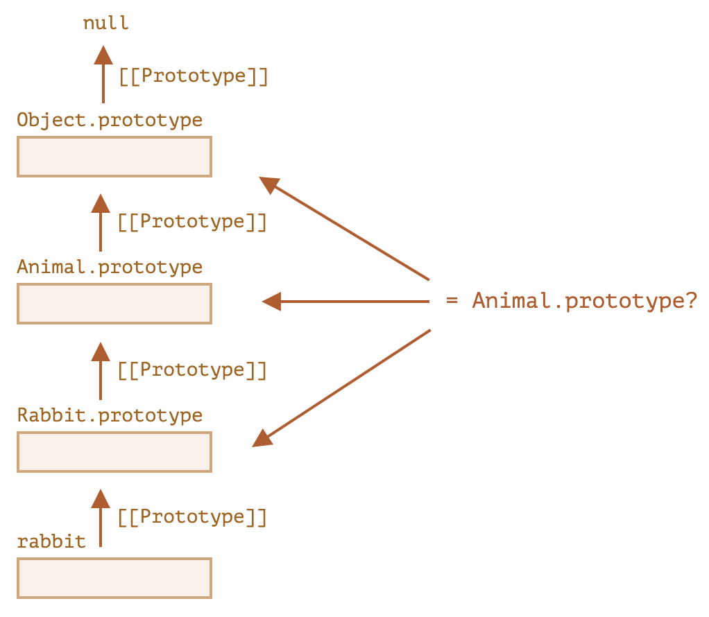

# 判断类型

JS 判断数据类型有以下方法：

- `typeof` 运算符
- `instanceof` 运算符
- `Object.prototype.toString()`

## typeof

返回参数类型的字符串。

```js
typeof 0; // number
typeof 0n; // bigint
typeof ""; // string
typeof true; // boolean
typeof null; // object
typeof undefined; // undefined
typeof Symbol("id"); // symbol
typeof {}; // object
typeof alert; // function
```

对于 8 种数据类型，绝大部分都会返回对应的字符串，有以下例外：

- `typeof null` 结果是 `object`，这是 JS 早期的实现错误，为了兼容性而保留下来，实际上 `null` 与 `object` 毫无关系，是两种不同的数据类型，或者说 `null` 是一种特殊值
- `typeof alert` 结果是 `function`，实际上函数也属于对象类型，但 `typeof` 会区别对待函数，这是 JS 早期的遗留问题，但也给编程带来了很大的方便

优点：

- 支持 8 种数据类型和函数

缺点：

- `null` 判断有误
- 对象类型只能区分函数，无法区分其他对象类型

## instanceof

检查对象是否属于某个类或其派生类。适用于 `class` 和构造函数。

```js
obj instanceof Class;
```

执行过程：

1. 如果 `Class` 有静态方法 `Symbol.hasInstance`，就直接调用。
2. 大部分 `Class` 没有这个方法，就检查 `Class.prototype` 是否等于 `obj` 原型链中的一个。
   - 等价于 `Class.prototype.isPrototypeOf(obj)`
   - 检查 `Class.prototype` 是否在 `obj` 的原型链上



优点：

- 支持所有对象类型，考虑继承在部分情况下会带来方便

缺点：

- 只支持对象，不支持原始类型
- 考虑继承导致无法精确判断对象的类型

## obj.constructor

通过 `obj.constructor` 访问构造函数。

## Object.prototype.toString()

`Object.prototype.toString()` 是把对象转换为字符串的默认方法，也能揭示值的类型。

```js
const objectToString = Object.prototype.toString;
objectToString.call(1); // [object Number]
objectToString.call(1n); // [object BigInt]
objectToString.call(""); // [object String]
objectToString.call(true); // [object Boolean]
objectToString.call(null); // [object Null]
objectToString.call(undefined); // [object Undefined]
objectToString.call(Symbol("id")); // [object Symbol]
objectToString.call({}); // [object Object]
objectToString.call(alert); // [object Function]
objectToString.call([]); // [object Array]
```

其实 `[object xxx]` 中的 `xxx` 是由对象的一个属性 `[Symbol.toStringTag]` 决定的，可以通过设置这个属性的值来修改 `toString()` 的输出。

```js
let user = {
  [Symbol.toStringTag]: "User",
};
alert({}.toString.call(user)); // [object User]
```

大多数特定于环境的对象 (比如浏览器的 `window`) 都有一个这样的属性：

```js
alert(window[Symbol.toStringTag]); // Window
alert({}.toString.call(window)); // [object Window]
```

优点：

- 支持 8 种数据类型，能区分内建对象

缺点：

- 自定义类型需要设置 `[Symbol.toStringTag]`，不能直接用

## Array.isArray()

判断传入的值是否为数组。

```js
Array.isArray(value);
```
