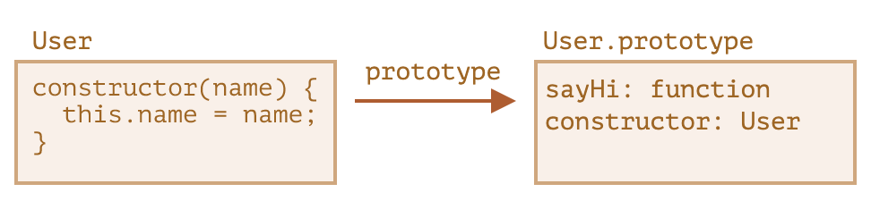
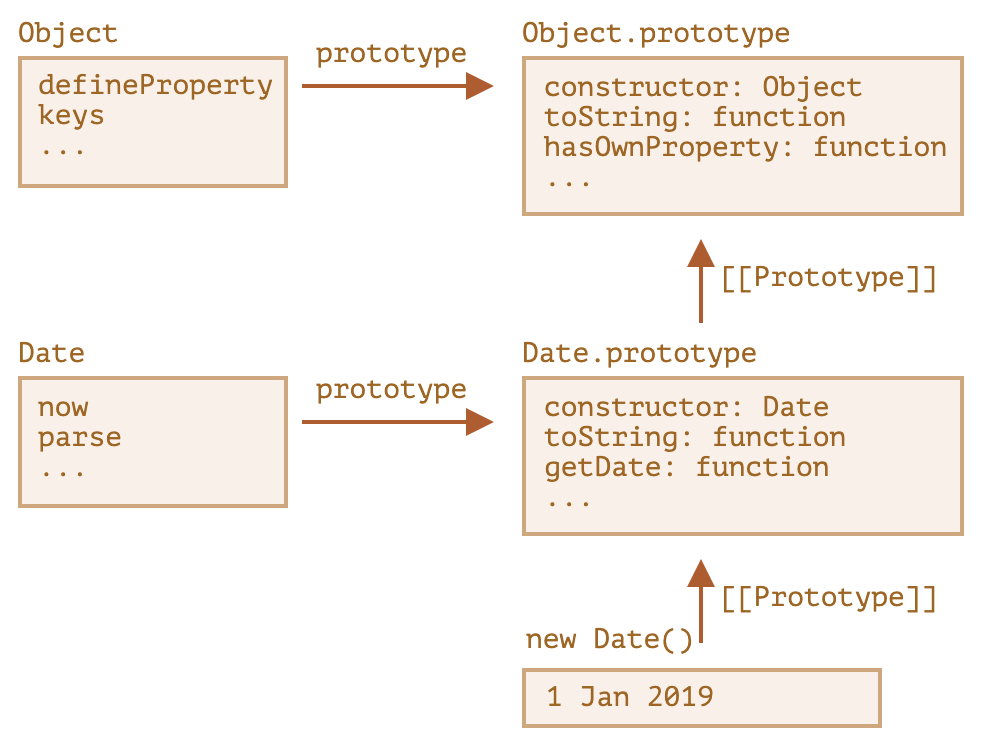

# class

`class` 是现代 JS 创建自定义类型的方式。

语法：

```js
class MyClass {
  prop1 = value1;

  constructor() { ... }

  get prop2() { ... }
  set prop2(newVal) { ... }

  method1(...) { ... }
  ...
}
```

然后可以使用 `new MyClass()` 创建对象，会调用 `constructor` 函数。

本质：

- 创建一个名为 `MyClass` 的构造函数，参数和函数体来自 `constructor`
- 在函数体内设置类属性，比如 `prop1`
- 把访问器属性和方法设置在原型对象 `MyClass.prototype` 上，比如 `prop2`、`method1`



与构造函数的区别：

- 内部属性 `[[IsClassConstructor]]` 的值为 `true`
  - JS 会在很多地方用到这个属性，来区分 class 和构造函数
    - 必须使用 `new` 调用，直接调用会报错
    - `toString()` 的输出以 `class` 开头
- 位于原型上的方法不可枚举
  - `enumerable: false`
- 总是使用 `use strict`

类似于函数，类声明也可以作为匿名或命名表达式，比如作为函数的参数和返回值。

如果把方法使用箭头函数声明为属性，可以避免丢失 `this` 的问题。但是这个方法将在每个对象上都有一份拷贝。

```js
class Button {
  constructor(value) {
    this.value = value;
  }
  click = () => {
    alert(this.value);
  };
}
```

## static

可以使用 `static` 声明静态属性和静态方法。

```js
class MyClass {
  static staticProp = value;
  static staticMethod() { ... }
}
// 等价于
MyClass.staticProp = value;
MyClass.staticMethod = function () { ... }
```

## extends

`class` 使用 `extends` 让一个类继承另一个类。

```js
class Rabbit extends Animal { ... }
```

本质：

- 把 `Rabbit.prototype.[[Prototype]]` 设置为 `Animal.prototype`
- 把 `Rabbit.[[Prototype]]` 设置为 `Animal`


- 可以在子类 constructor 中使用 `super(...)` 调用父类 constructor
- 可以在子类方法中使用 `super.method(...)` 调用父类方法
- 箭头函数没有自己的 `super`，与声明时外部环境的 `super` 相同
- `super` 使用内部属性 `[[HomeObject]]` 实现，值为函数声明时所在的对象

如果子类没有指定 constructor，会默认生成以下 constructor：

```js
class Rabbit extends Animal {
  constructor(...args) {
    super(...args);
  }
}
```

- 子类的 constructor **必须**调用父类的 constructor，并且在 `this` 的访问之前
  - 为了实现父类实例属性的继承 (非原型属性)
  - 使用 `new` 执行子类 constructor 时，不会创建空对象并赋值给 `this`，而是期望父类 constructor 完成这项工作
- 子类属性会在父类 constructor 返回后开始初始化

## 私有属性和方法

JS 没有在语言层面提供声明私有属性和方法的能力，可以用下划线 `_` 开头的名称表示这个属性或方法是私有的。

```js
class CoffeeMachine {
  _waterAmount = 0;
}
```

## 内建类型

- 我们可以继承内建类型实现自己的类型，比如 `Array`
- 内建类型之间不继承静态方法，只继承访问器属性和实例方法


