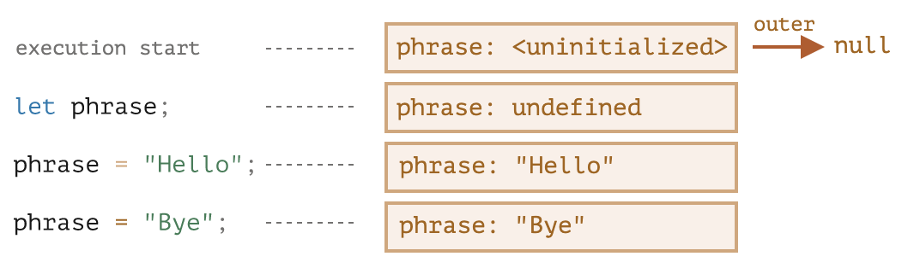

# 闭包

**闭包 (closure)** 指的是函数声明时绑定外部环境的变量 (而**不是**动态绑定调用时的外部环境)，后续调用仍能访问和修改这些变量，通常适用于函数作为一等公民的语言。

## 作用域

变量有 3 种作用域，只在所处的作用域中可见：
- 全局作用域
- 函数作用域
- 块作用域

## 词法环境

每个作用域都有一个称为**词法环境 (Lexical Environment)** 的隐藏对象，由 2 部分组成：
- 环境记录 (Environment Record)：存储所有局部变量作为属性
- 对外部词法环境的引用 (全局词法环境无外部引用)

对于**变量**来说，词法环境预先读取所有声明的变量，设为未初始化 (Uninitialized) 状态，在遇到声明之前不能引用，就像该变量不存在一样。遇到声明语句后，变量可以被读取和修改。



对于**函数**来说，词法环境会预先**读取并初始化**所有声明的函数，允许调用下方声明的函数。


访问变量时，首先搜索当前作用域的词法环境，其次是外部以及更外部，直到全局。如果都没找到，严格模式下报错，非严格模式下会声明一个全局变量 (奇怪的行为)。

## 闭包的实现原理

函数同样有自己的词法环境，并使用 `[[Environment]]` 隐藏属性存储对外部环境的引用，创建函数时会自动设置这个属性，从而实现“记住”声明时的外部变量。

不管这个函数被传递到什么地方调用，调用时的外部词法环境永远是声明时的外部环境，与调用时的外部环境无关，保证了函数的可用性。


## 垃圾收集

通常一个函数执行结束后，如果没有其他变量引用这个函数环境，该环境会从内存中删除，也就是所谓的“垃圾回收”。如果函数返回了另一个函数，该嵌套函数引用了外部函数的词法环境，就不会发生垃圾回收，直到返回的嵌套函数不被使用后，才会回收函数的环境。

```js
function f() {
  let value = 123;
  return function() {
    console.log(value);
  }
}
let g = f(); // 当 g 函数存在时，f 的环境会被保留在内存中
g = null; // 现在内存被清理了
```

目前主流的 V8 引擎会对这种情况做一些优化，如果返回的函数没有引用外部环境的任何变量，则外部环境也没有必要保存，会从**外部环境链**上删除。

```js
let value = "Surprise!";

function f() {
  let value = "the closest value";
  function g() {
    debugger; // 在 Console 中输入 value 会显示 "Surprise!"
  }
  return g;
}

let g = f();
g();
```

## var

`var` 是 ES6 之前声明变量的方式，ES6 引入的 `let` 和 `const` **彻底**取代了 `var`。`var` 有一些与作用域相关的奇怪性质。

`var` 只有全局作用域和函数作用域，没有块级作用域。代码块中的变量能够被外部访问，只有函数能隔绝变量。

```js
function sayHi() {
  if (true) {
    var phrase = "Hello";
  }
  alert(phrase); // Hello
}
sayHi();
alert(phrase); // ReferenceError: phrase is not defined
```

`var` 重复声明不会报错，后续重复的声明会被当作赋值。

```js
var user = "Pete";
var user = "John";
alert(user); // John
```

与 `let/const` 不同，`var` 在作用域一开始就可以被引用，称为变量提升 (hoisting)。相当于在作用域一开始就声明了所有变量，但是没有赋值，只有遇到真正的声明语句时才会进行初始化，在那之前变量的默认值是 `undefined`。

```js
function sayHi() {
  console.log(phrase); // undefined
  phrase = "Hello";
  console.log(phrase); // Hello
  var phrase = "World";
  console.log(phrase); // World
}
sayHi();
```

## IIFE

由于 `var` 声明的变量只能通过函数来隔离作用域，开发者发明了一种使用函数来模仿块级作用域的方式，称为 **IIFE (Immediately Invoked Function Expression)**。

原理就是把需要放在块级作用域的代码封装为一个函数表达式并马上执行，这样代码中的变量就会与外界隔离。

```js
(function() {
  var message = "Hello";
  alert(message); // Hello
})();
```