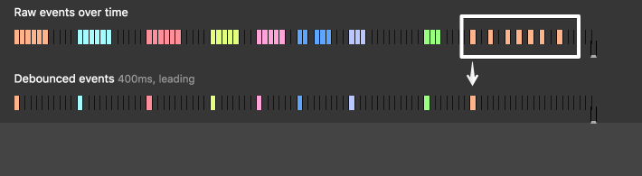
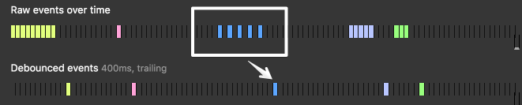

# 防抖和节流

浏览器的部分事件触发频率很高，超出了应用需求，以相同频率执行事件处理函数会造成不必要的性能开销。比如 `resize`、`scroll`、`keypress`、`mousemove` 等。

**防抖 (debounce)** 和**节流 (throttle)** 可以让高频调用的函数在内部以更低的频率执行，既不影响需求的实现，又提高了性能。


## 防抖

设定一个最短执行间隔，如果小于最短间隔连续多次调用，最终只执行一次。

应用场景：

- 输入框 `input` 事件，用于表单校验、实时请求等
- 窗口 `resize` 事件，调整完成后再重新渲染

有两种执行模式：

- `leading`
  - 定时器设置为：最短间隔后把定时器变量设为 `null`
  - 每次调用都重置定时器 (没到期就停止再重新开始，到期就直接开始)
  - 如果定时器变量为 `null` (表示定时器已到期，间隔足够长)，执行一次
    
- `trailing`
  - 定时器设置为：最短间隔后执行函数
  - 每次调用都重置定时器
  - 如果间隔足够长，则定时器已到期，函数执行了一次；否则定时器还没到期就被重置
    

```js
function debounce(func, wait = 0, leading = false) {
  let timeout = null;
  return function () {
    const args = arguments;
    clearTimeout(timeout); // 传无效参数不会有影响
    if (leading) {
      const callNow = !timeout;
      timeout = setTimeout(() => {
        timeout = null;
      }, wait);
      if (callNow) {
        func.apply(this, args);
      }
    } else {
      timeout = setTimeout(() => {
        func.apply(this, args);
      }, wait);
    }
  };
}
```

### Lodash

```js
_.debounce(func, [(wait = 0)], [(options = {})]);
```

```js
window.onscroll = _.debounce(scrollHandler, 200); // 200ms
scrollHandler.cancel(); // 如果需要的话，可以取消防抖，每次调用都执行
```

## 节流

设定一个最短执行间隔 (与防抖的最短间隔**含义不同**)，每个间隔内最多执行一次。

应用场景：

- 页面 `scroll` 事件，实现滚动加载
- 搜索框 `input` 事件，实现搜索联想

执行过程：

- 定时器设置为：最短间隔后把定时器变量设为 `null`
- 如果定时器变量不为 `null`，说明间隔足够长，定时器已过期，重置定时器并执行一次函数

```js
function throttle(func, wait = 0) {
  let timeout = null;
  return function () {
    if (!timeout) {
      timeout = setTimeout(() => {
        timeout = null;
      }, wait);
      func.apply(this, arguments);
    }
  };
}
```

### Lodash

```js
_.throttle(func, [(wait = 0)], [(options = {})]);
```

### requestAnimationFrame

相当于 `throttle(func, 16)`，但是精确度更高。Lodash 的内部实现采用了该函数。

需要重新计算和渲染元素，并且想要保证变化的平滑性，可以使用该方法。
