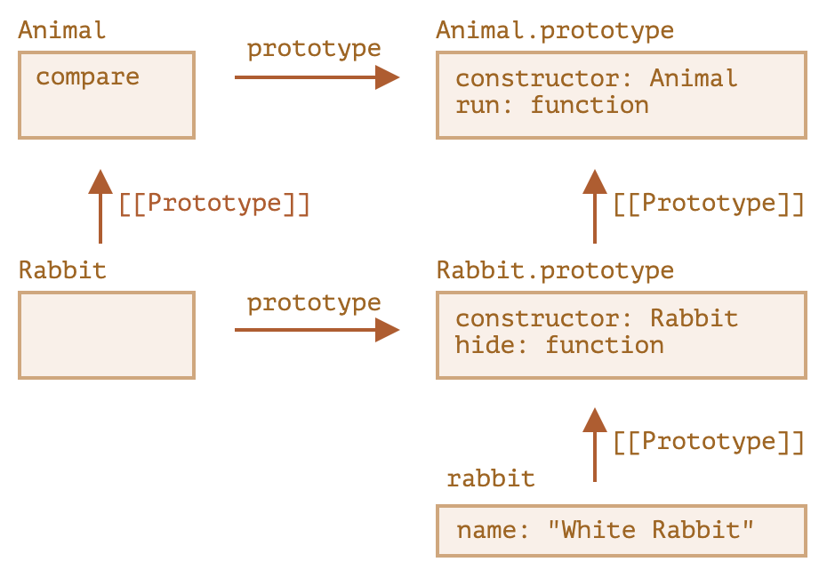

# 继承

父类的属性可以分为两类：

- 自有属性/实例属性：在构造函数内设置的属性
- 继承属性/原型链：`SuperType.prototype` 以及相应的原型链

## 继承实例属性

在子类构造函数内部使用当前 `this` 调用父类构造函数，从而把父类的实例属性设置到子类上。

```js
function SubType() {
  SuperType.call(this);
}
```

## 继承原型链

把子类构造函数的原型的原型设置为父类构造函数的原型。

```js
Object.setPrototypeOf(SubType.prototype, SuperType.prototype);
```

## 完整继承

组合上述两种方法，就可以实现每个子类对象都有父类实例属性的一份拷贝，并且能够访问到父类的原型链。

```js
function SubType() {
  SuperType.call(this);
}
Object.setPrototypeOf(SubType.prototype, SuperType.prototype);
```

## 临时继承

如果想临时创建一个对象继承自另一个对象，可以手动设置对象的原型。

```js
Object.create(proto);
```

- 如果创建多个对象继承同一个对象，继承的属性是共享的

## 多继承

每个对象只能有一个原型，如果想从多个父类继承，可以把其他父类的属性复制到子类的原型上。

```js
SubType.prototype = Object.create(SuperType.prototype);
Object.assign(
  SubType.prototype,
  OtherSuperType.prototype,
  AnotherSuperType.prototype
);
```

## class extends

ES6 引入的最直观的继承语法，与 “完整继承” 的原理相同。

```js
class SubType extends SuperType { ... }
```


