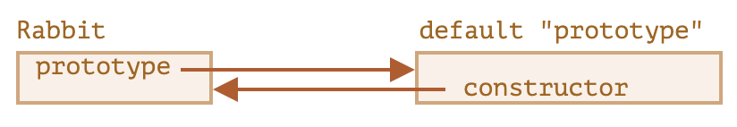
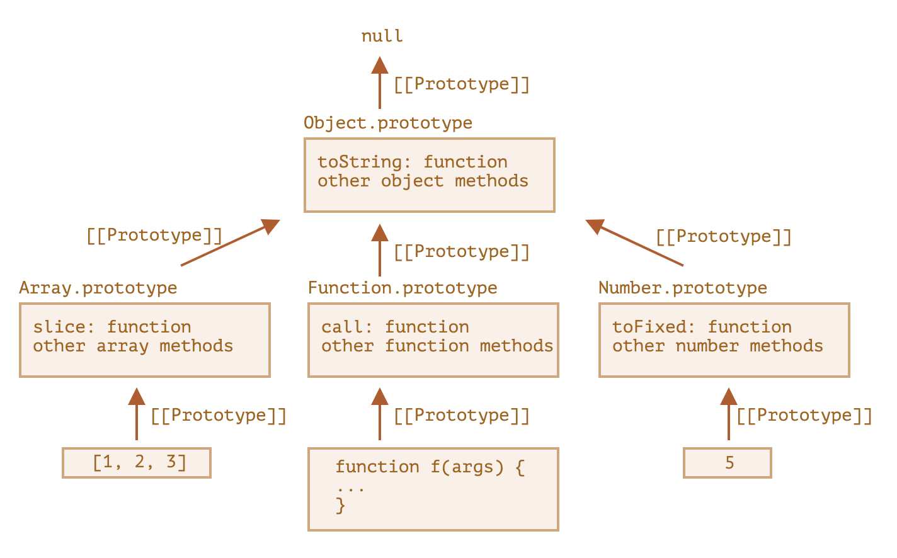

# 原型

JavaScript 通过原型 (prototype) 支持 OOP 中的继承。

## 什么是原型

JavaScript 中的每个对象有一个隐藏属性 `[[Prototype]]`，称为该对象的**原型**。隐藏属性指的是 JS 引擎内部维护该属性，用户代码无法**直接**访问。原型的值要么为 `null`，要么为另一个对象。

原型对象也可以有原型，这样就构成了一条**原型链** (prototype chain)。原型链上的所有属性都会被对象所**继承**。访问属性时首先查找对象的自有属性，然后查找原型属性。设置属性只针对对象本身，不会修改原型链。

有 2 种方法读写对象的原型：
- `__proto__` 属性
    - 需要注意的是，`__proto__` 只是 `[[Prototype]]` 的 getter/setter
- `Object.getPrototypeOf/Object.setPrototypeOf` 方法

## 构造函数与原型

除了手动设置对象的原型实现继承之外，更多的是让一个类型继承另一个类型，从而使子类型的所有对象都能继承父类型的属性。JavaScript 中使用构造函数定义一个类型 (假设是 `F`)，使用 `new F(args)` 创建该类型的对象。

构造函数 `F` 可以设置一个属性 `prototype`，使用 `new` 操作符创建对象时，如果 `F.prototype` 是一个对象，则会把这个对象设置为新创建对象的原型 `[[Prototype]]`。

```js
const animal = {
  eats: true
};

function Rabbit(name) {
  this.name = name;
}
Rabbit.prototype = animal;

const rabbit = new Rabbit("White Rabbit"); // rabbit.__proto__ === animal
console.log(rabbit.eats); // true
```

## 默认原型

每个函数默认存在 `prototype` 属性，是只有一个属性 `constructor` 的对象，值为函数本身。

```js
function Rabbit() {}

console.log(Rabbit.prototype); // { constructor: Rabbit }
```



`constructor` 的值可以被所有 `Rabbit` 创建出的对象访问，因此可以使用与一个对象相同的构造函数创建另一个对象。

```js
const rabbit = new Rabbit("White Rabbit");
const rabbit2 = new rabbit.constructor("Black Rabbit");
```

为了不覆盖 `constructor` 这一有用的属性，修改函数的 `prototype` 时尽量不要完全替换，而是往上面添加属性，或者完全替换后手动加上 `constructor`。

## Object.prototype

原型通常用于提供该类型的一些实用函数，比如 `toString`、`forEach` 等。使得一个该类型的空对象 (没有自有属性) 可以直接调用这些实用函数。

JavaScript 编程中使用的对象绝大部分都直接或间接继承自 `Object.prototype`，该原型提供了大量适用于对象的实用函数。

其他内建类型，比如 `Array`、`Date`、`Function` 等，都提供了自己的原型方法，而这些原型对象 (`Array.prototype` 等) 自身也是对象，它们的原型为 `Object.prototype`。



## Object.create

创建对象时指定原型的方法有 2 种：
- 字面量中包括 `__proto__`
- `Object.create(proto)`

`Object.create(proto, propertiesObject)` 也可以用于拷贝一个对象 (浅拷贝)，包括自有属性和原型 (继承属性)，自有属性包括可枚举和不可枚举的、数据属性和访问器属性，真正做到了**完全拷贝**。

```js
const clone = Object.create(
  Object.getPrototypeOf(obj),
  Object.getOwnPropertyDescriptors(obj)
);
```