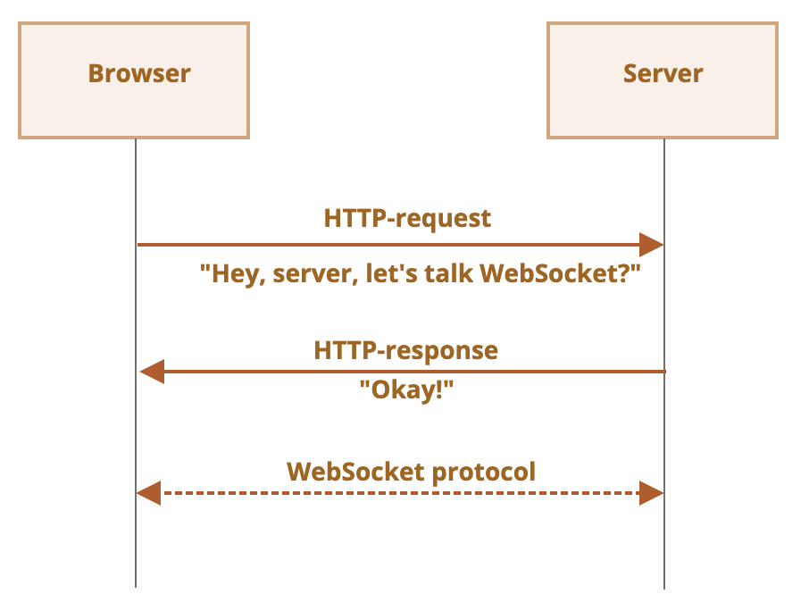

# WebSocket

WebSocket 用于在客户端和服务端之间建立持久连接、进行全双工通信。

聊天软件、网络游戏、实时交易系统等应用需要使用 WebSocket。

## WebSocket 基本使用

### 创建 socket

socket (套接字) 是数据传输的一个端点，首先需要创建 socket，用于后续的数据交互。

```js
let socket = new WebSocket("ws://javascript.info");
```

WebSocket 使用 `ws` 协议，类似于 HTTP，还有类似于 HTTPS 的 `wss`。

### 监听事件

socket 会触发 4 种事件：
- `open`：连接建立
- `message`：接收到消息
- `error`：发生错误
- `close`：连接关闭

使用 `on<event>` 添加事件处理函数，使用 `socket.send` 发送数据。

```js
socket.onopen = function(e) {
  alert("[open] Connection established");
  alert("Sending to server");
  socket.send("My name is John");
};

socket.onmessage = function(event) {
  alert(`[message] Data received from server: ${event.data}`);
};

socket.onclose = function(event) {
  if (event.wasClean) {
    alert(`[close] Connection closed cleanly, code=${event.code} reason=${event.reason}`);
  } else {
    // 例如服务器进程被杀死或网络中断
    // 在这种情况下，event.code 通常为 1006
    alert('[close] Connection died');
  }
};

socket.onerror = function(error) {
  alert(`[error] ${error.message}`);
};
```

## 连接建立

WebSocket 建立连接时，首先使用 HTTP 询问服务端是否支持 WebSocket，如果支持则后续使用 WebSocket 进行通信。



假如要连接到 `wss://javascript.info/chat`，HTTP 请求报文如下：
```text
GET /chat
Host: javascript.info
Origin: https://javascript.info
Connection: Upgrade
Upgrade: websocket
Sec-WebSocket-Key: Iv8io/9s+lYFgZWcXczP8Q==
Sec-WebSocket-Version: 13
```

- `GET` 请求
- `Origin`：当前页面 URL，WebSocket 原生支持跨域，不需要服务端做 CORS
- `Connection: Upgrade`：客户端想要更改协议
- `Upgrade: websocket`：更改为 WebSocket 协议
- `Sec-WebSocket-Key`：浏览器随机生成的密钥
- `Sec-WebSocket-Version`：WebSocket 协议版本

服务端同意切换为 WebSocket 时的响应报文：
```text
101 Switching Protocols
Connection: Upgrade
Upgrade: websocket
Sec-WebSocket-Accept: hsBlbuDTkk24srzEOTBUlZAlC2g=
```

- `Sec-WebSocket-Accept`：服务端使用特殊算法将 `Sec-WebSocket-Key` 重新编码

## 数据传输

WebSocket 通信以 frame 为单位，有以下几种类型：
- text：文本数据
- binary data：二进制数据
- ping/pong：服务端检查连接
- connection close：连接关闭

`send` 只能发送文本或二进制数据，支持 `String`、`Blob`、`ArrayBuffer` 等类型。

`socket.binaryType` 指定二进制数据的格式，默认是 `blob`。

## 流量控制

如果接收方的网速很慢，需要发送的数据就会大量缓存在发送方的内存中，可以通过检查已缓冲的字节数来调整发送速率，使缓存消耗的内存不至于过多：
```js
// 每 100ms 检查一次 socket
// 仅当所有现有的数据都已被发送出去时，再发送更多数据
setInterval(() => {
  if (socket.bufferedAmount == 0) {
    socket.send(moreData());
  }
}, 100);
```

## 连接关闭

通信双方都可以主动关闭连接，发送可选的 code 和 reason。

```js
socket.close([code], [reason]);
```

常见 code：
- `1000`：默认，正常关闭
- `1001`：一方离开，比如浏览器关闭页面
- `1006`：连接丢失时自动发送，无法手动发送
- `1009`：消息太大，无法处理
- `1011`：服务端意外错误
- 不能设置小于 `1000` 的 code

## 获取连接状态

`socket.readyState` 表示连接状态：
- `0`：CONNECTING，正在建立连接
- `1`：OPEN，连接建立，通信中
- `2`：CLOSING，正在关闭连接
- `3`：CLOSED，连接已关闭
