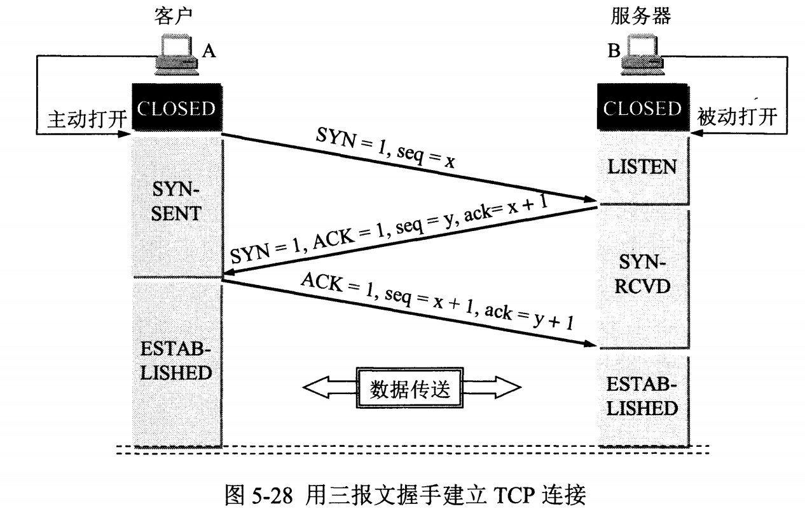
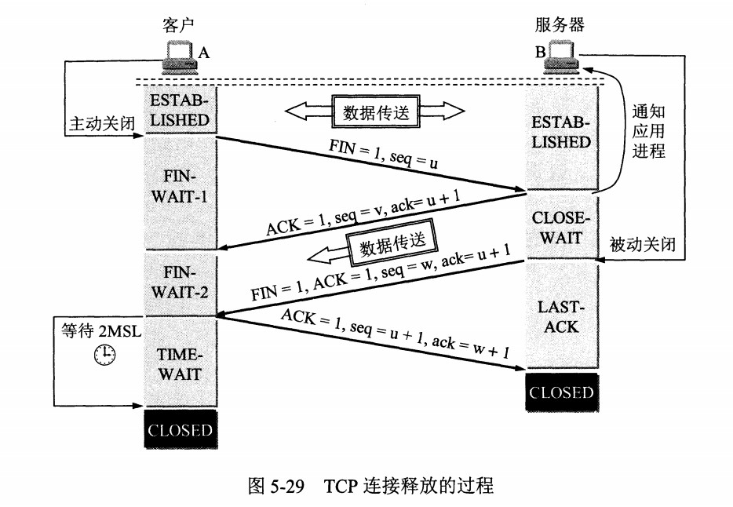

# TCP

## 连接建立

第 3 个确认报文是为了防止失效的连接请求到达服务器，造成服务器错误地打开连接。比如客户端发送的第 1 个连接请求报文滞留在网络中但没有丢失，客户端未收到确认一段时间后超时重传，但是最初滞留的请求报文最终会到达服务器。

如果只有两次握手，服务器收到请求就会打开连接，可能打开不需要的连接，造成资源浪费。

如果需要三次握手，尽管服务器收到了滞留的请求报文，并发回确认报文，但由于此时客户端不需要建立连接，不会发回第 3 个确认报文，TCP 连接就无法建立。

## 连接释放

服务端发送第 2 个确认报文后，进入 **CLOSE-WAIT** 状态。TCP 连接进入半关闭状态，客户端不能向服务端发送数据，但服务端可以向客户端发送数据，便于把还未传送完毕的数据发送完。

客户端发送第 4 个连接释放响应报文后，进入 **TIME-WAIT** 状态，等待 2 个 MSL (Maximum Segment Lifetime，最大报文存活时间) 的时间后进入 **CLOSED** 状态。原因是：

- 确保最后一个确认报文能够到达。
  - 如果 B 没收到 A 发送来的确认报文，就会超时重传。
  - A 等待一段时间就是为了处理这种情况的发生，在等待期间如果收到重传的释放请求报文就可以重新发送确认报文。
- 让本连接持续时间内所产生的所有报文都从网络中消失，使得下一个新的连接不会出现旧的连接请求报文。

## 可靠传输

TCP 使用**超时重传**来实现可靠传输，如果已经发送的报文在指定时间内没有收到确认，就重新发送这个报文。

超时重传的时间称为 RTO (Retransmission TimeOut) = RTTs + 4 \* RTTd

RTTs 是加权平均往返时间，根据每次通信的 RTT 实时更新：RTTs = (1 - a) \* RTTs + a \* RTT

- 初始 RTTs 值为 RTT
- a 是范围 [0, 1) 的参数，a 越大，最新的 RTT 对 RTTs 的影响就越大，推荐值是 1/8

RTTd 是 RTTs 与 RTT 偏差的加权平均值：RTTd = (1 - b) \* RTTd + b \* |RTTs - RTT|

- 初始 RTTd 值为 RTT 的一半
- b 是范围 [0, 1) 的参数，b 越大，最新的偏差对 RTTd 的影响就越大，推荐值是 1/4

Karn 算法：发生超时重传，说明网络发生了拥塞，应该把 RTO 的值增大一点，避免更多的超时重传，通常增大为原来的 2 倍。直到不再发生超时重传，继续使用上面的公式计算 RTO。

## TCP 和 UDP 的区别

|                  | TCP                  | UDP                                |
| ---------------- | -------------------- | ---------------------------------- |
| 是否面向连接     | 面向连接             | 无连接                             |
| 是否可靠         | 提供可靠交付         | 尽最大努力交付                     |
| 报文大小         | 面向字节流，大小不等 | 交付完整报文                       |
| 拥塞控制         | 有，慢开始/拥塞避免  | 无，能够保证恒定的发送速率         |
| 是否支持多方通信 | 只能是一对一         | 支持一对一、一对多、多对一、多对多 |
| 性能             | 开销大               | 开销小                             |
| 应用层协议       | HTTP/TLS/FTP/SMTP    | DNS/DHCP                           |
