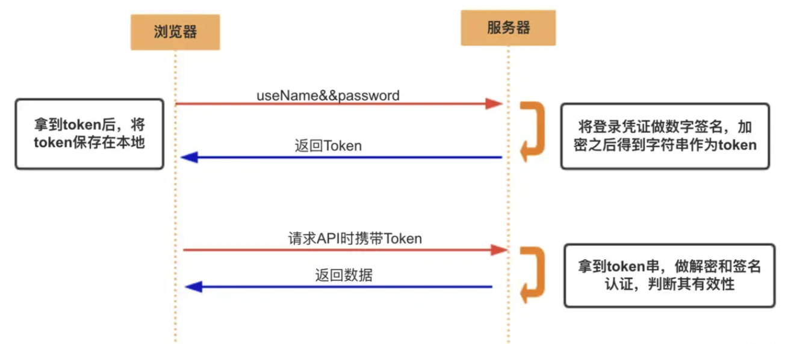

# Token

Token 是一种**无状态**的认证和授权机制，相比 Session 对服务器的负担更小。

## Access Token

Access Token 用于请求接口时的身份认证。

1. 登录后从服务端获取 token，保存在浏览器中。
2. 后续请求接口都带上 token。
3. 服务端解析 token，检查是否为有效 token，有效则返回响应。

## Refresh Token

Access Token 的有效期通常较短，Refresh Token 用于重新获取 Access Token (刷新)，通常有效期较长。

如果 Refresh Token 也过期了，就只能重新登录了。
