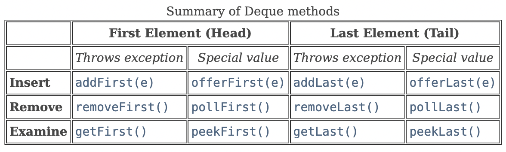
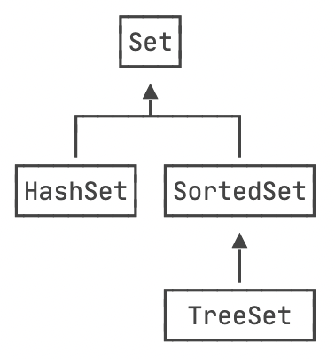

# 集合

## Deque



## Stack (Deque)

`java.util.Stack` 已经不推荐使用，推荐用 `Deque` 实现 `Stack` 的功能。

```java
Deque<String> stack = new LinkedList();
stack.offerLast("123");
stack.size(); // 1
stack.peekLast(); // "123"
stack.pollLast(); // "123"
```

## Map

- key/value 只能是对象，不能是原始类型
- 构造函数不支持传入初始数据，需要创建空 Map 后逐个 put

```java
Map<String, Integer> map = new HashMap();
map.put("1", 1); // true
map.size(); // 1
map.containsKey("1"); // true
map.get("1"); // 1
map.remove("1"); // true
map.isEmpty(); // true
```

## Set



```java
Set<String> set = new HashSet();
set.add("123"); // true
set.size(); // 1
set.contains("123"); // true
set.remove("123"); // true
```
