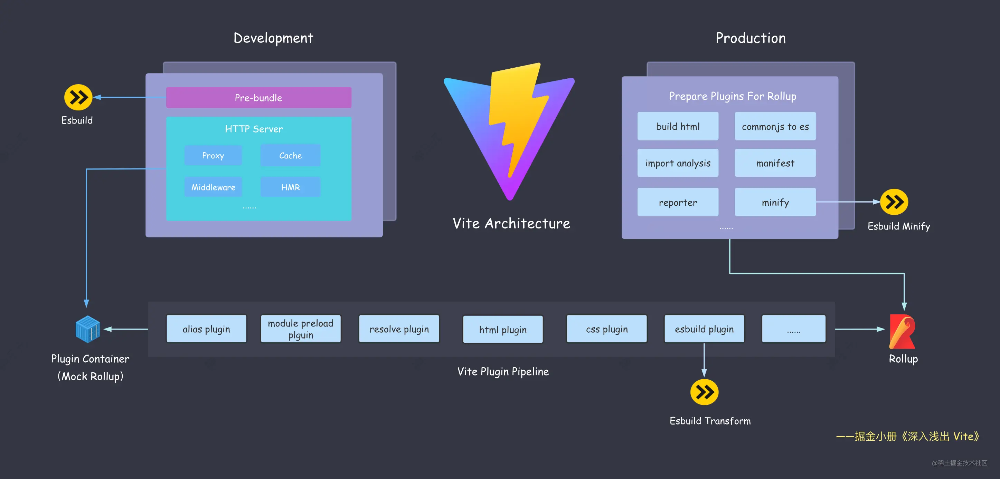

# Vite 架构

## esbuild

1. 开发阶段预构建 (Bundler)
   - 打包第三方依赖，转换为 ESM 格式
2. 开发和生产阶段语法转译 (Transformer)
   - 代替 Babel/TSC 转译 TS/JSX
   - 通过 Vite 插件提供
   - 不支持类型检查，生产阶段会先执行 TSC
3. 生产阶段代码压缩 (Minifier)
   - 通过 Vite 插件提供
   - 代替很慢的 Terser

## Rollup

1. 生产阶段打包
   - CSS 代码分割
   - 自动预加载
   - 异步 chunk 加载优化
2. 兼容插件机制
   - Vite 插件兼容 Rollup
   - Rollup 插件有很多兼容 Vite
