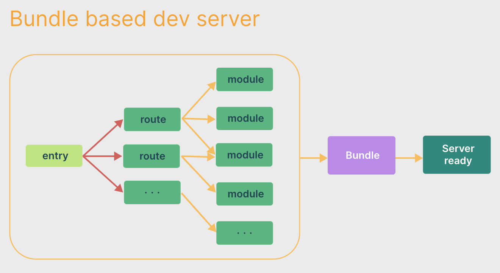
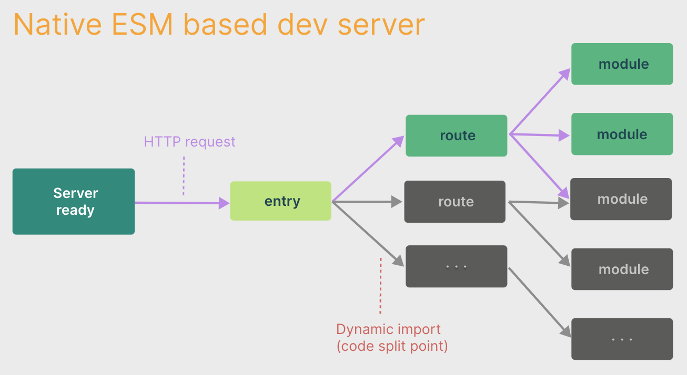

# Vite

背景：

- 随着应用规模的增长，基于 JavaScript 开发的打包工具**冷启动**和**热更新**都很慢
- 浏览器开始原生支持 ES 模块
- 越来越多 JavaScript 工具使用编译型语言编写

冷启动：

- 将应用中的模块区分为**依赖**和**源码**两类
- 使用 esbuild 预构建第三方依赖，esbuild 使用 Go 编写，比 JS 打包器快 10-100 倍
  - 原因：
    - 很多第三方库不提供 ESM 产物
    - 一些第三方库模块数量多、依赖层级深，会触发过多网络请求
  - 过程：
    - 把第三方库尽可能打包，并转换为 ESM 格式
    - 预构建产物缓存在 `node_modules/.vite` 目录下
    - 重写源码中第三方库的引入路径
- 源码按需编译为 ESM 格式，Vite 在浏览器请求源码时进行转换并按需提供源码
  - 让浏览器接管了打包程序的部分工作
  - 根据情景动态导入代码，只在当前屏幕上实际使用时才会被处理

热更新：

- HMR 在原生 ESM 上执行，精确地使已编辑的模块与其**最近的 HMR 边界**之间的链失活
  - 无论应用大小如何，HMR 始终能保持快速更新
- 利用 HTTP 头来加速整个页面的重新加载
  - 依赖模块的请求会通过 `Cache-Control: max-age=31536000,immutable` 进行**强缓存**
  - 源码模块的请求会根据 `304 Not Modified` 进行**协商缓存**

生产环境：

- 使用 Rollup 打包
- 嵌套导入会导致额外的网络往返，导致效率低下 (即使使用 HTTP/2)
- 为了获得最佳的加载性能，最好将代码进行 tree-shaking、懒加载和 chunk 分割（以获得更好的缓存）
