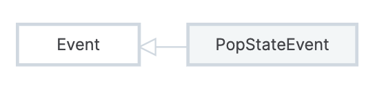

# window.history

`window.history` 是一个 `History` 对象，可以进行页面导航。

会话历史 (session history)：当前标签页访问过的所有页面。

出于安全因素，`window.history` 访问不到会话历史的 URL。

属性：

- `length`：会话历史的长度，只读属性
- `scrollRestoration`：是否自动复原滚动位置，`auto` 或 `manual`
- `state`：当前页面的状态

方法：

- `back()`：后退，效果等同于点击后退按钮
- `forward()`：前进，效果等同于点击前进按钮
- `go(delta = 0)`：相对当前页面跳转 delta 步，默认刷新当前页面
- `pushState(state, unused[, url])`：添加一条历史记录
  - `state`：状态对象，会传入 popstate 的处理函数
  - `unused`：历史遗留，一般传一个空字符串
  - `url`：同源的新 URL，可以是绝对 URL 或相对路径，默认是当前页面 URL
  - 特点：只会添加记录 (并改变地址栏 URL)，不会真正进行页面跳转
- `replaceState(state, unused[, url])`：替换当前历史记录
  - 参数与 `pushState` 相同，区别是替换当前记录而不是添加一条新记录

`popstate` 事件：

- 当前历史记录改变时触发

```js
addEventListener("popstate", (event) => {});
```


