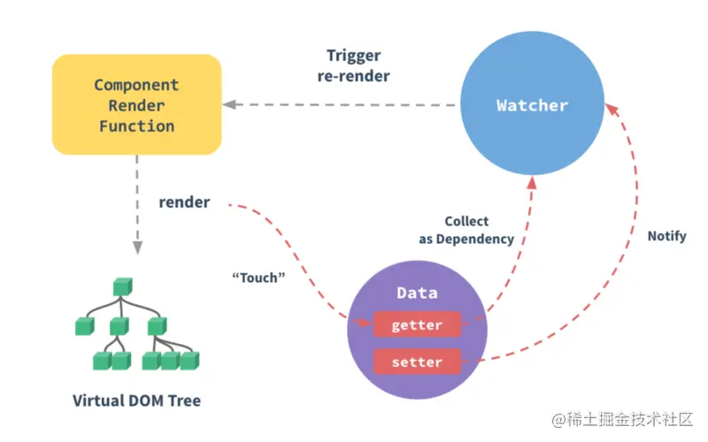
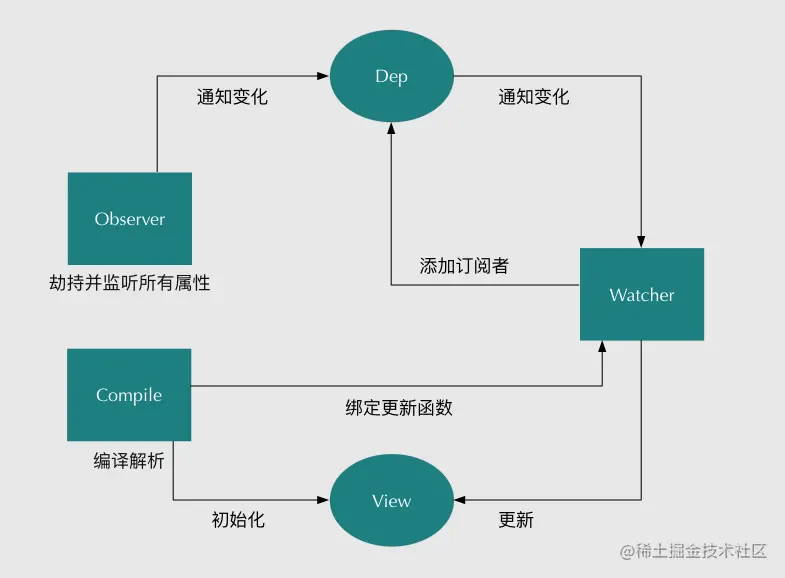

# 响应式系统

响应式系统是 Vue 的一大特色功能，无需手动 *setState*，当依赖改变时自动重新计算响应式变量的值。





## 响应式本质

利用 JavaScript 提供的能力拦截对象属性的访问和修改：
- 访问器属性的 `getter/setter`
- `Proxy`

Vue 2 使用 getter/setter，Vue 3 的 reactive 使用 Proxy、ref 使用 getter/setter。

以下是 Vue 3 中 reactive 和 ref 的核心实现思路：
- 访问属性时调用 `track` 函数建立响应式变量与依赖之间的**订阅**关系
- 修改属性时调用 `trigger` 函数触发以该属性为依赖的**所有**响应式变量的重新计算

```js
function reactive(obj) {
  return new Proxy(obj, {
    get(target, key) {
      track(target, key)
      return target[key]
    },
    set(target, key, value) {
      trigger(target, key)
      target[key] = value
    }
  })
}

function ref(value) {
  const refObject = {
    get value() {
      track(refObject, 'value')
      return value
    },
    set value(newValue) {
      trigger(refObject, 'value')
      value = newValue
    }
  }
  return refObject
}
```

## 响应式流程

1. 假如需要声明一个响应式变量 `A2`，依赖于 `A0` 和 `A1`。首先需要将 A2 的计算过程包装成一个**函数**，这个函数会产生**副作用**，那就是计算并更新 A2 的值。

```js
let A2

function update() {
  A2 = A0 + A1
}
```

2. 将 A0 和 A1 通过 getter/setter 或 Proxy 包装成响应式对象，使我们能够拦截对 A0 和 A1 的读写操作，从而在其中添加 track 和 trigger 函数。Vue 3 可以使用 ref。

```js
A0 = ref(0)
A1 = ref(1)
```

根据 ref 的定义，会在读取 value 时跟踪副作用函数 `update`，修改 value 时重新执行 update。

以下是 track 和 trigger 的具体实现。在 track 中把副作用函数加入到依赖属性的订阅列表中，使用全局变量 `activeEffect` 保证订阅操作只发生一次 (如果不显式设置 activeEffect，则调用 track 不会进行订阅，这也是为什么每次访问属性都会调用 track 但不会造成重复订阅)。在 trigger 中获取属性的订阅列表，依次重新执行。

```js
let activeEffect

function track(target, key) {
  if (activeEffect) {
    const effects = getSubscribersForProperty(target, key)
    effects.add(activeEffect)
  }
}
```

```js
function trigger(target, key) {
  const effects = getSubscribersForProperty(target, key)
  effects.forEach((effect) => effect())
}
```

对 A2 来说，是把 update 函数添加到 A0 和 A1 的订阅者集合里，当修改 A0 或 A1 时，会重新执行 A0 或 A1 的所有订阅者函数 (包括 update)，从而实现 A2 的响应式更新。

3. 最后一步就是**注册**这个副作用函数，设置 `activeEffect` 为副作用函数 `update`，并执行一次副作用函数 (结果作为响应式变量的初始值)，保证每个依赖属性的 `track` 被调用一次并建立订阅关系。

```js
function whenDepsChange(update) {
  const effect = () => {
    activeEffect = effect
    update()
    activeEffect = null
  }
  effect()
}
```

用 Vue 3 的语法来写就是：

```js
const A0 = ref(0)
const A1 = ref(1)
const A2 = computed(() => A0.value + A1.value)
```
